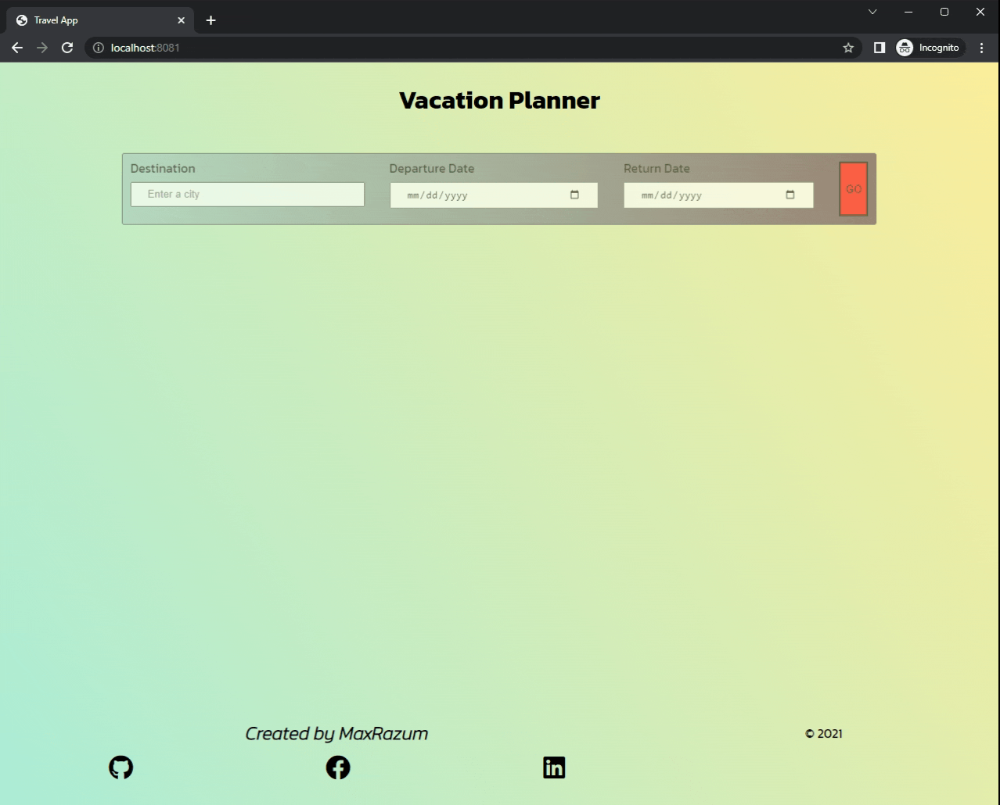

# Travel App

* This project obtains a desired trip location and date from the user, and displays weather and an image of the location using information obtained from external APIs.

## Project Extensions

* Added end date to display length of trip.

### LANGUAGES

    - Javascript
    - HTML
    - SCSS

### Built with

- [Node.js](https://nodejs.org/en/) - Node.js® is a JavaScript runtime built on Chrome's V8 JavaScript engine.
- [Express.js](https://expressjs.com/) - Fast, unopinionated, minimalist web framework for Node.js.
- [Webpack.js](https://webpack.js.org/) - Webpack takes modules with dependencies and generates static assets representing those modules.

## Preview


## Instructions

* Download the zip file locally.
* Navigate to the project directory `cd ***` Replace *** with the project directory.
* Install all dependencies using command `npm i`
* Go to [Geonames](http://www.geonames.org/export/web-services.html) and register for an account.
* Go to [Weatherbit](https://www.weatherbit.io/account/create) and register for an account.
* Go to [Pixabay](https://pixabay.com/api/docs/) and register for an account.
* At the root of the project, create a new file named `.env`
* Inside the file, add `GEONAMES_KEY=***` Replace *** with your API key from Geonames.
* Inside the file, add `WEATHERBIT_KEY=***` Replace *** with your API key from Weatherbit.
* Inside the file, add `PIXABAY_KEY=***` Replace *** with your API key from Pixabay.
* To run the developer server use command `npm run build-dev`
* The developer server runs on `localhost:8080`
```
* To run the production server use `npm run go`
* The production server runs on `localhost:8081`
```